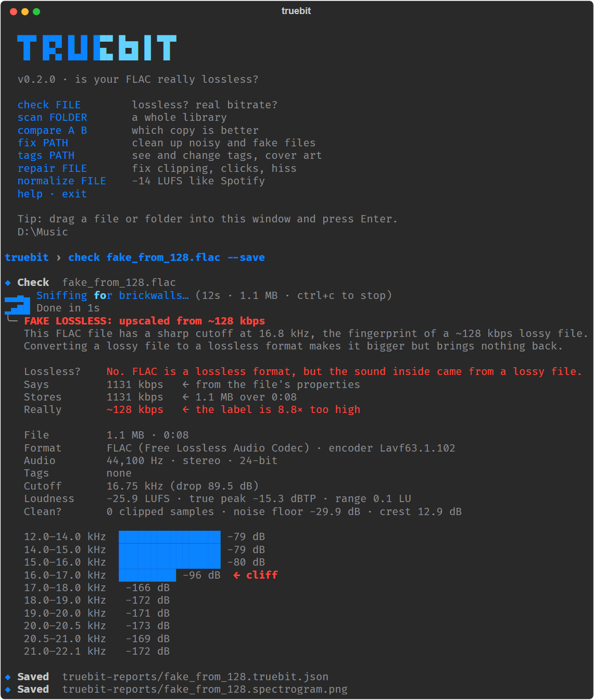
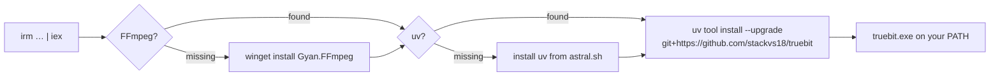
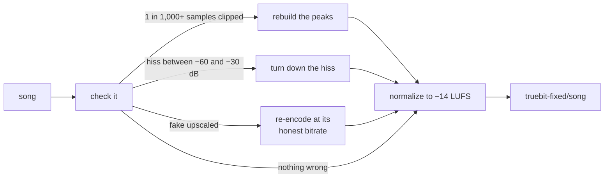
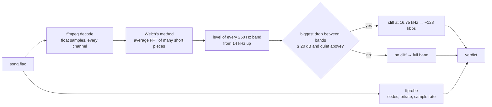
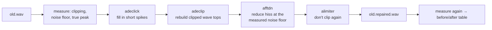
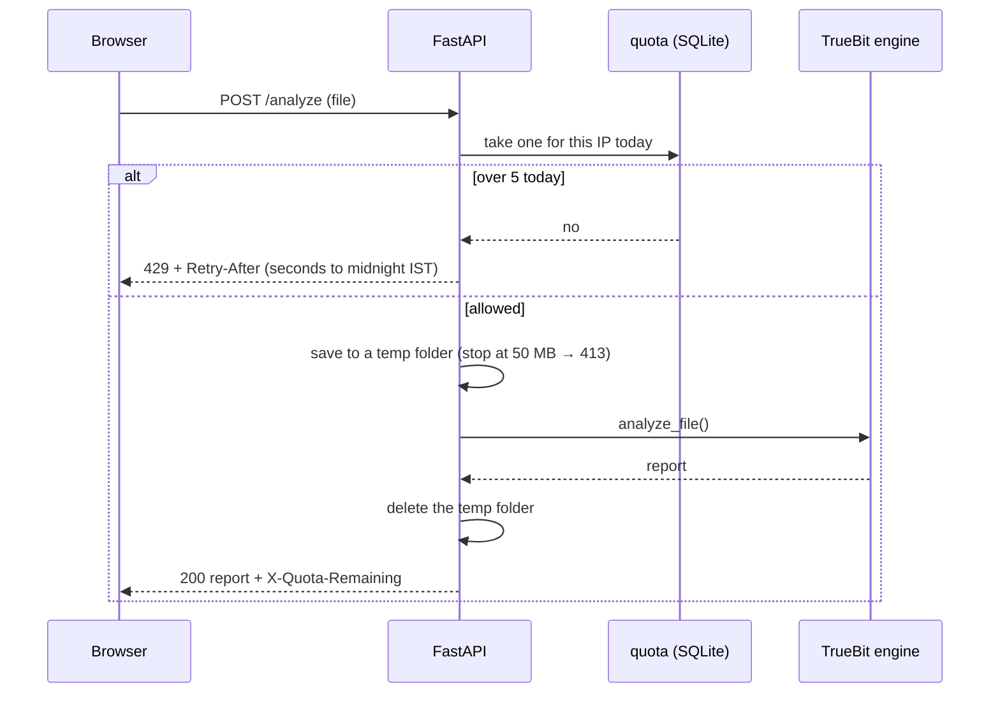
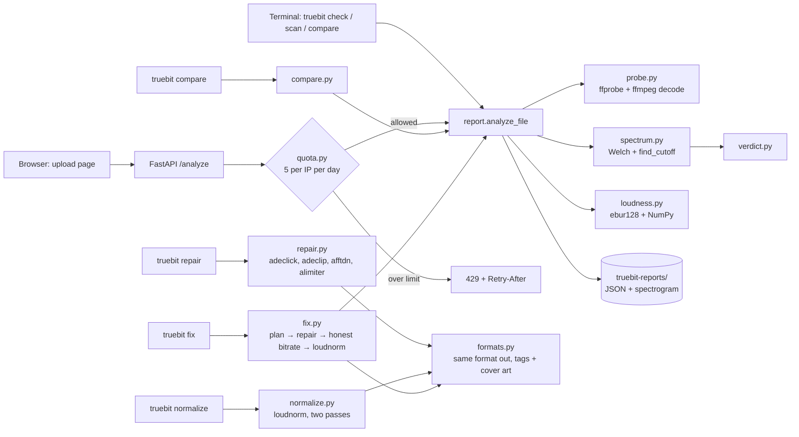

# TrueBit

**Is your FLAC really lossless?** TrueBit checks any audio file (FLAC, WAV, AIFF, ALAC, MP3, M4A/AAC, OGG, Opus, WMA…) for what's really inside: whether it's **truly lossless**, the bitrate its **properties say** versus what it **really holds**, plus tags, cover art, encoder and loudness, and lets you **change the tags for good** without touching the sound. It catches fake lossless and fake 320 kbps audio by the frequency "cliff" every encoder leaves behind, then **fixes** problem files: noisy, clipped and fake upscaled audio comes out clean, honest and evenly loud. It's an interactive terminal app, and also a web API.

```powershell
irm https://raw.githubusercontent.com/stackvs18/truebit/main/install.ps1 | iex
```



---

## Why

Music sold or shared as **"FLAC"** or **"320 kbps"** is often a **128 kbps MP3 converted upwards**. The file gets bigger and the label says "lossless", but the sound the MP3 threw away is gone for good.

You can't tell from the file name, the size or the bitrate on the label. A fake FLAC made from a 128 kbps MP3 even shows a *higher* bitrate (1131 kbps) than a real one (890 kbps). Desktop tools exist (Spek, Fakin' The Funk), but they're GUIs. TrueBit is one command in the terminal, scans whole libraries, fixes damaged audio, and runs as an API too.

---

## Install

Paste one line into **PowerShell** (Windows 10/11):

```powershell
irm https://raw.githubusercontent.com/stackvs18/truebit/main/install.ps1 | iex
```



- It installs FFmpeg (with winget) and [uv](https://docs.astral.sh/uv/) if you don't have them, then TrueBit itself, in its own isolated folder with its own Python.
- **Running it again updates TrueBit.** Remove it with `uv tool uninstall truebit`.
- It runs inside a function, so it leaves your PowerShell session as it found it. As with any `irm | iex`, [read the script](install.ps1) first.
- Once the web app is hosted, its short link does the same: `irm https://<your-site>/install.ps1 | iex`.
- macOS / Linux: install FFmpeg and uv, then `uv tool install git+https://github.com/stackvs18/truebit`.

---

## Use it

Type `truebit` and it opens like an app: the TRUEBIT logo, then a `truebit ›` prompt that stays open until `exit`. Type any command, or drag a file (checked) or a folder (scanned) into the window and press Enter.

```
  ▀█▀ █▀█ █ █ █▀▀ █▄▄ █ ▀█▀
   █  █▀▄ █▄█ ██▄ █▄█ █  █
  v0.2.0 · is your FLAC really lossless?

truebit › check fake_320.mp3
◆ Check  fake_320.mp3
▅▇▃▂ Sniffing for brickwalls… (1s · 237 KB · ctrl+c to stop)
▂▄▆█ Done in 1s
╰─ FAKE 320 kbps: really ~128 kbps
   It claims 320 kbps, but the cutoff at 16.8 kHz matches a ~128 kbps source.

   Lossless?    No. MP3 is a lossy format: some sound was thrown away when it was encoded.
   Says         320 kbps (CBR)   ← from the file's properties
   Stores       323 kbps   ← 237 KB over 0:06
   Really       ~128 kbps   ← the label is 2.5× too high

   File         237 KB · 0:06
   Format       MP3 (MPEG audio layer 3) · encoder Lavc63.1
   Audio        44,100 Hz · stereo
   Tags         none
   Cutoff       16.75 kHz (drop 89.5 dB)
   Loudness     -25.9 LUFS · true peak -15.1 dBTP · range 0.0 LU
   Clean?       0 clipped samples · noise floor -29.9 dB · crest 13.1 dB

   16.0–17.0 kHz  █████████ -96 dB  ← cliff
truebit › fix fake_320.mp3
truebit › exit
```

Every command also works directly:

| Command | What it does |
|---|---|
| `truebit` | Opens interactive mode (`help`, `clear`, `exit`) |
| `truebit check FILE` | **Lossless or not?** What the bitrate **says**, what the file **stores**, what the sound is **really** worth; plus format, encoder, tags, cover art, loudness, clipping, noise and a band chart showing the cliff |
| `truebit check FILE --save` | Also saves a JSON report and a spectrogram to `./truebit-reports/` (never next to your music) |
| `truebit scan FOLDER` | Every audio file in a folder and its sub-folders, with Says / Stores / Really columns and a count of genuine lossless, fake and lossy files; `--json report.json` saves everything |
| `truebit fix FILE or FOLDER` | **Fixes problem files**: rebuilds clipped peaks, turns down hiss, re-encodes fakes at their honest bitrate, normalizes loudness. Saves to `./truebit-fixed/`, never touching the originals |
| `truebit tags FILE or FOLDER` | **Every tag** (title, artist, album, year, track, comment, lyrics, encoder, any custom tag) and the cover art. `--set title="My Song"`, `--remove comment`, `--clear`, `--cover art.jpg`, `--remove-cover`, `--save-cover cover.jpg` change them **permanently** (it asks first; `--yes` skips the question, `--output copy.mp3` changes a copy instead) |
| `truebit compare A B` | **Which copy is genuinely better**, judged by what's really in the files, not the label |
| `truebit repair FILE` | Rebuilds clipped peaks, removes clicks, reduces hiss; shows before/after numbers. `--strength light/medium/strong`, `--no-declick`, `--no-denoise`… |
| `truebit normalize FILE` | Sets loudness to **−14 LUFS** like Spotify/YouTube; `--preset apple` (−16), `broadcast` (−23), or `--target -12` |
| `--format mp3` (on fix, repair, normalize) | Save as another format: `mp3`, `m4a`, `aac`, `flac`, `wav`, `aiff`, `ogg`, `opus`, `wma` |
| `truebit serve` | Web upload page and JSON API |
| `truebit version` | The installed version |

Verdicts: **GENUINE LOSSLESS** · **FAKE LOSSLESS: upscaled from ~128 kbps** · **FAKE 320 kbps: really ~128 kbps** · **This is a lossy file**.
**Reads:** FLAC, WAV, AIFF, ALAC, APE, WavPack, TTA, MP3, MP2, M4A/M4B/AAC, OGG Vorbis, Opus, WMA, AC3, MKA, WebM… (anything FFmpeg reads).
**Writes back in the same format:** FLAC, WAV, AIFF, ALAC, MP3, M4A/AAC, OGG, Opus, WMA, keeping the tags and cover art. Formats TrueBit can't write become FLAC (lossless ones) or M4A (lossy ones).

While it works, an animated **equalizer** bounces in macOS blue next to a shimmering verb that changes every 2 seconds (*Sniffing for brickwalls, Interrogating the Nyquist, Bribing the FFT…*) and a live timer. The analysis runs in a background thread while `rich.live.Live` redraws the line 20 times a second.

---

## Says, stores, really: the bitrate truth

A music player shows one bitrate, and it can be a lie. TrueBit shows three:

| Line | Where it comes from | Fake "320 kbps" MP3 |
|---|---|---|
| **Says** | The bitrate in the file's properties (what Windows Explorer or a music player shows), plus CBR or VBR for MP3s | 320 kbps (CBR) |
| **Stores** | File size × 8 ÷ length: the data really in the file | 323 kbps |
| **Really** | Where the sound stops (the cutoff), mapped to the encoder setting that cut it there | **~128 kbps**, the label is 2.5× too high |

- A fake FLAC made from a 128 kbps MP3 **says** and **stores** 1,134 kbps, but is **really** ~128 kbps: 8.9× inflated.
- Variable-bitrate files can **say** one thing and **store** another: an OGG labelled 192 kbps stored 145 kbps.
- For MP3s, TrueBit reads the encoder ("LAME3.100") and whether the bitrate is constant or variable from the file's first frame (LAME writes an `Info` header for CBR and `Xing` for VBR).
- The cutoff → bitrate table was measured on MP3s. AAC, Opus and Vorbis keep more treble per kbps, so for them TrueBit says where the sound stops ("cut at 16.5 kHz") instead of guessing a bitrate.

---

## Fix: noisy, clipped and fake upscaled audio



`truebit fix "D:\Music"` checks every file, decides what it needs and saves the result to `./truebit-fixed/`:

| Problem found | What fix does |
|---|---|
| **Clipping** on at least 1 in 1,000 samples | Rebuilds the cut-off wave tops (`adeclip`), then a limiter so they don't clip again |
| **Background hiss** (a noise floor between −60 and −30 dB) | Turns it down at the measured level (`afftdn`) |
| **Fake lossless** (a FLAC/WAV made from an MP3) | Saves it as an MP3 at its honest bitrate: no lossless sound was in it to keep |
| **Fake bitrate** (a "320 kbps" MP3 that's really 128) | Re-encodes it at its honest bitrate, in its own format |
| Every file | Normalizes the loudness to −14 LUFS (`--target` to change), keeps the tags and cover art |

**Honest bitrate** = one step above what the sound really holds, so re-encoding adds no audible loss, but under TrueBit's 1.4× "fake" limit: ~128 kbps → **160**, ~192 → **224**, ~256 → **320**. A fixed fake comes out **smaller and honestly labelled**. It doesn't come out better, because nothing can bring back what the first encoder deleted. Repairs happen in a 32-bit float temporary file, so the only lossy step is the final encode.

---

## Tags: see and change the metadata

```
truebit › tags song.mp3 --set title="Don't Stop" --set year=2024 --set track=3/12 --remove album --cover art.png
Change the tags of 1 file permanently? (The sound itself isn't touched.) [y/N]: y
◆ Tags  song.mp3 (1 file)
┌───────────┬───────────┬──────────────────────┐
│ Tag       │ Before    │ After                │
├───────────┼───────────┼──────────────────────┤
│ album     │ Demo      │ removed              │
│ title     │ Test Song │ Don't Stop           │
│ track     │ —         │ 3/12                 │
│ year      │ —         │ 2024                 │
│ cover art │           │ PNG picture, 45 KB   │
└───────────┴───────────┴──────────────────────┘
╰─ Changed 1 of 1 file. Only the tags were rewritten: the audio is exactly the same.
```

- `truebit tags song.mp3` lists **every** tag, including encoder, lyrics, ReplayGain and custom ones, plus the cover art and where the tags are stored.
- `truebit tags "D:\Music\Album"` shows title / artist / album / year / track / cover for every file, and `--set album="Best Of" --yes` changes the whole folder at once.
- The same names work in every format: `title`, `artist`, `album`, `albumartist`, `year`, `genre`, `track`, `disc`, `composer`, `comment`. Any other name becomes a custom tag (`--set mood=happy`).
- Edits are **permanent**: the file itself is changed (TrueBit asks first). Only the tag part is rewritten, never the audio. The tests check this with a fingerprint of the decoded sound before and after, in every format.

| Format | Where the tags live | Cover art |
|---|---|---|
| MP3, WAV, AIFF | ID3v2 tag (saved as v2.3, which Windows reads best) | ✓ |
| FLAC, OGG, Opus | Vorbis comments | ✓ |
| M4A, M4B (AAC and ALAC) | MP4 (iTunes) atoms | ✓ |
| WMA | ASF attributes | read only |
| APE, WavPack | APEv2 tag | read only |
| Raw AAC (`.aac`) | can't hold tags: save it as M4A first | — |

Built on [mutagen](https://mutagen.readthedocs.io/), which reads and writes all of these in pure Python.

---

## How detection works

To save space, every MP3/AAC encoder removes high frequencies with a **low-pass filter**. A 128 kbps MP3 keeps nothing above about **16.75 kHz**; a 320 kbps MP3 keeps up to about **20 kHz**; real CD-quality audio has sound up to **22 kHz**. Converting the MP3 back to FLAC can't bring those frequencies back, so the "FLAC" has a sharp **cliff** in its spectrum.



1. **Probe:** `ffprobe` gives the codec, container, bitrate, sample rate, bit depth, channels and duration.
2. **Decode:** `ffmpeg` pipes raw 32-bit float samples straight into NumPy (no temporary files).
3. **Spectrum:** `scipy.signal.welch(nperseg=8192)` takes the FFT of many overlapping pieces and averages them into a clean energy-per-frequency curve.
4. **Bands:** the average level of every 250 Hz band from 14 kHz to the top.
5. **Cliff:** the biggest drop between a band and the band two steps above. It counts only if the drop is **≥ 20 dB** and everything above stays at least 20 dB quieter.
6. **Likely source:**

   | Cliff at | Likely original |
   |---|---|
   | below 17.25 kHz | ~128 kbps |
   | 17.25–18.8 kHz | ~160–192 kbps |
   | 18.8–19.8 kHz | ~256 kbps / V0 |
   | 19.8–20.8 kHz | ~320 kbps |
   | no cliff | consistent with real lossless |

   Calibrated on files made with the LAME encoder through FFmpeg. These are estimates, and TrueBit says so.
7. **Verdict:** a lossless container **with** a cliff → **fake lossless**; a lossy file claiming ≥ 1.4× the bitrate its cliff allows → **fake bitrate**; lossless with no cliff → **genuine lossless**; otherwise an honest lossy file.
8. **Loudness:** FFmpeg's EBU R128 meter gives integrated loudness (LUFS), loudness range and true peak; NumPy gives sample peak, RMS, crest factor, clipped samples and the noise floor, measured on **every channel**.

**Try it on a fake you make yourself:**

```powershell
ffmpeg -i song.flac -b:a 128k small.mp3
ffmpeg -i small.mp3 fake.flac
truebit check fake.flac          # FAKE LOSSLESS: upscaled from ~128 kbps
```

---

## Repair, normalize and compare



**`repair`** chains FFmpeg's restoration filters. The noise floor is **measured first** and passed to the denoiser, so it removes hiss and not music: without that, noise went from −35.3 to only −35.7 dB; with it, to **−49.7 dB**. On dense, loud music with no quiet gaps, a "noise floor" above −30 dB is treated as music and a gentle default is used. Repair fixes damage. It can't bring back frequencies an MP3 encoder deleted (nothing can), and it says so.

**`normalize`** runs EBU R128 `loudnorm` in two passes: measure, then apply **one exact gain change** with `linear=true` so the dynamics stay untouched. The original sample rate is kept, and the true peak is capped at −1 dBTP.

**`compare`** ranks by what's really in the files: genuine lossless first (then higher sample rate and bit depth), then the **higher real cutoff**, then **fewer clipped samples**. It warns if the two lengths differ by more than 3 s (probably different recordings).

Outputs are saved next to the input (`song.repaired.mp3`, `song.normalized-14.flac`) **in the original's format**: an MP3 stays an MP3 (at its original bitrate or the next standard one up), an ALAC stays ALAC, and tags and cover art are kept. `--format` saves as something else.

---

## Results

**On test files made with FFmpeg:**

| File | Label says | TrueBit says |
|---|---|---|
| `real.flac` | FLAC 890 kbps | ✅ **GENUINE LOSSLESS** (no cliff) |
| `fake_from_128.flac` | FLAC **1131** kbps | ❌ **FAKE LOSSLESS: upscaled from ~128 kbps** (cliff 16.75 kHz, drop 89.5 dB) |
| `fake_320.mp3` | MP3 320 kbps | ❌ **FAKE 320 kbps: really ~128 kbps** |
| `mp3_320.mp3` | MP3 320 kbps | honest lossy (cliff 20.0 kHz) |
| `mp3_128.mp3` | MP3 128 kbps | honest lossy (cliff 16.75 kHz) |

Repair (strong): 75,482 clipped samples → **0**, background noise −35.3 → **−49.7 dB**. Normalize: −48.75 → **−14.0 LUFS**. Compare: the real 890 kbps FLAC beats the 1131 kbps fake.

**On a real library of 36 songs (MP3 and AAC):**

| Feature | Result |
|---|---|
| Scan | **11 fakes**: 8 MP3s labelled 256 or 320 kbps that are really ~128, and 3 AACs, e.g. a "262 kbps" M4A whose sound stops at 15.0 kHz |
| Fix | A fake "320 kbps" MP3 with 1,780,272 clipped samples at +0.8 LUFS → peaks rebuilt, honest **160 kbps** MP3 at −14.4 LUFS, **7.9 → 3.9 MB**. A fake "262 kbps" AAC → honest 160 kbps AAC, **3.1 → 1.9 MB** |
| Repair | A bass-boosted track: **1,626,790 clipped samples → 0**, true peak +4.8 → +1.8 dBTP |
| Normalize | A master at **+0.78 LUFS** → exactly **−14 LUFS** |
| Compare | Two copies with the same cutoff: kept the one with 168,866 clipped samples instead of 1,780,272 |

Real-world testing found four bugs, each now fixed with a regression test:
1. **False clipping.** FFmpeg's stereo-to-mono downmix *adds* the channels, so a clean song peaking at 0.95 looked like it peaked at 1.29 (33,810 "clipped" samples). Now peaks and clipping are measured on every channel, and mono is made by averaging.
2. **Loud masters crashed normalize.** `loudnorm` rejects a measured loudness above 0 LUFS, and one master measured +0.78. The measurements are now kept inside the filter's allowed ranges.
3. **TrueBit's own outputs looked fake.** `repair` and `normalize` used to save MP3s as FLAC; scanning the library afterwards flagged those files as FAKE LOSSLESS. Outputs now keep the original format.
4. **Piped output crashed on Windows** (found while testing the installer). `truebit scan D:\Music > report.txt` used Windows' old cp1252 encoding, which has no `◆` or `█`. Output is now always UTF-8.

---

## Web API

```powershell
truebit serve          # http://127.0.0.1:8000  ·  API docs at /docs
```

| Method | Endpoint | Returns |
|---|---|---|
| GET | `/` | Drag-and-drop upload page, with the one-line install command and a Copy button |
| POST | `/analyze` | Upload a file (max 50 MB), get the full JSON report; `?spectrogram=true` adds the picture as base64 |
| GET | `/health` | `{"status": "ok", "version": "0.2.0"}` |
| GET | `/install.ps1` | The short install link: redirects to [`install.ps1`](install.ps1) on GitHub, so `irm https://<your-site>/install.ps1 \| iex` works |



- **5 analyses per IP per day**, reset at midnight India time (SQLite table `usage(ip, day, count)`).
- Non-audio files get **400** and broken audio gets **422**; neither uses up a turn.
- Uploads are deleted right after analysis.

<details>
<summary><b>The JSON report</b> (for <code>fake_from_128.flac</code>, band list shortened)</summary>

```json
{
  "verdict": "fake_lossless",
  "verdict_headline": "FAKE LOSSLESS: upscaled from ~128 kbps",
  "verdict_detail": "This FLAC file has a sharp cutoff at 16.8 kHz ...",
  "lossless": {"is_lossless": false, "answer": "No. FLAC is a lossless format, but the sound inside came from a lossy file."},
  "bitrate": {"label_kbps": 1134, "stored_kbps": 1134, "real_kbps": 128, "real_text": "~128 kbps",
              "inflated_times": 8.9, "mode": null},
  "file": {"container": "flac", "codec": "flac", "codec_name": "FLAC (Free Lossless Audio Codec)",
           "lossy_codec": false, "bitrate_kbps": 1134, "data_rate_kbps": 1134, "sample_rate_hz": 44100,
           "bit_depth": 24, "channels": 2, "channel_layout": "stereo", "duration_seconds": 6.0,
           "file_size_bytes": 850123, "encoder": "Lavf63.1.102", "tags": {}, "has_cover_art": false},
  "loudness": {"integrated_lufs": -25.9, "loudness_range_lu": 0.1, "true_peak_dbtp": -15.3,
               "sample_peak_dbfs": -12.4, "rms_dbfs": -25.3, "crest_factor_db": 12.9,
               "noise_floor_dbfs": -26.8, "clipped_samples": 0},
  "spectrum": {"cutoff_hz": 16750, "cutoff_drop_db": 89.5, "nyquist_hz": 22050,
               "rolloff_median_hz": 4834,
               "bands": [{"from_hz": 16000, "to_hz": 17000, "level_db": -93.0}, "..."]}
}
```

</details>

### Hosting it (Render, free)

New → **Blueprint** → this repo. [`render.yaml`](render.yaml) builds the [`Dockerfile`](Dockerfile) (Python 3.12 + FFmpeg) in Singapore and checks `/health`. The free plan sleeps after 15 idle minutes (the next visit takes about a minute to wake it), and the daily-limit counts reset when it restarts.

Locally with Docker: `docker build -t truebit . && docker run -p 8000:8000 truebit`.

---

## Architecture



| Layer | Tool | Why |
|---|---|---|
| Language | **Python 3.11+** | Great for numbers, CLIs and APIs |
| Audio in/out | **FFmpeg / ffprobe** | Reads every format; professional filters (`ebur128`, `loudnorm`, `adeclip`, `adeclick`, `afftdn`, `showspectrumpic`) |
| Maths | **NumPy**, **SciPy** (`signal.welch`) | Fast sample arrays; Welch's method for a clean, averaged spectrum |
| CLI | **Typer** | Commands and options from plain Python functions |
| Terminal UI | **Rich** | Colours, tables, the live animated spinner |
| Web API | **FastAPI** + Uvicorn | File uploads, automatic `/docs` |
| Quota | **SQLite** | A tiny `usage(ip, day, count)` table, no server needed |
| Tags | **mutagen** | Reads and writes ID3, Vorbis comments, MP4 atoms, ASF and APEv2 tags without touching the audio |
| Packaging | **uv** + `pyproject.toml` | `uv tool install` puts `truebit` on your PATH; `install.ps1` does it in one line |
| Hosting | **Docker** + Render | Python and FFmpeg in one image |

---

## Project structure

```
src/truebit/
  cli.py        every command (Typer)
  shell.py      interactive mode: the truebit › prompt, dragged-in paths
  ui.py         the look: macOS blue, ◆ / ╰─ lines, equalizer spinner, logo
  formats.py    every audio format: which are lossy, how to write each one, honest bitrates
  probe.py      ffprobe details (bitrates, tags, cover art, encoder, CBR/VBR) + decoding to NumPy
  spectrum.py   Welch spectrum, 250 Hz bands, find_cutoff()
  verdict.py    cutoff → likely source → verdict; says / stores / really; "is it lossless?"
  loudness.py   EBU R128 loudness, true peak, RMS, crest factor, clipping, noise floor
  report.py     runs every check, saves JSON + spectrogram, finds audio files
  repair.py     declick → declip → denoise → limiter
  normalize.py  two-pass EBU R128 loudness normalization
  fix.py        one command for problem files: repair, make fakes honest, normalize
  tags.py       read every tag and change them for good (mutagen), cover art in and out
  compare.py    which copy is genuinely better
  output.py     shared: output file names, running FFmpeg (keeps tags and cover art)
  api.py        FastAPI: upload page, /analyze, /health, /install.ps1
  quota.py      5 analyses per IP per day (SQLite)
  upload.html   the upload page, with the same equalizer spinner
tests/          real test audio made with FFmpeg, in every format (70 tests)
scripts/        make_screenshot.py: records the terminal output as docs/check.png
install.ps1     one-line Windows installer; re-run to update
Dockerfile      Python + FFmpeg image for the web API
render.yaml     one-click Render deploy of that image
```

---

## Develop

```powershell
git clone https://github.com/stackvs18/truebit
cd truebit
uv sync
uv run truebit check some_song.flac
uv run pytest                    # 70 tests, about 25 seconds

# Make `truebit` a real command that uses this folder (code changes apply instantly)
uv tool install --editable . --force
```

The tests generate real audio with FFmpeg (pink noise, MP3 encodes, fakes, clipped tone bursts with hiss) and check the verdicts, the cutoff finder, every format in and out (MP3, M4A, AAC, OGG, Opus, WMA, WAV, AIFF, ALAC), says / stores / really, CBR vs VBR, tags and cover art surviving, tag editing in 8 formats with the sound fingerprinted before and after, fix on fakes and hiss, repair numbers, normalize accuracy (±1 LUFS), compare, interactive-mode parsing, piped output, the real-music bugs and every API status code.

---

## Known limits and next steps

**Limits**
- Cutoff → bitrate is an estimate calibrated on LAME; other encoders differ slightly.
- Very quiet or naturally band-limited recordings (old tapes) can look like a cliff.
- `check` and `scan` decode only the first 120 s of each file for the spectrum, peaks and clipping (plenty for the cutoff, and fast); LUFS and true peak cover the whole file.
- The web quota is per IP, so people on the same Wi-Fi share it.
- Repair can't restore frequencies an encoder deleted. Nothing can.

**Next steps**
1. A machine-learning classifier: encode lossless clips at 128/192/256/320 kbps (free labels), train on band energies, and report a confidence next to the rule-based verdict.
2. `truebit dupes`: find duplicate songs in a library and keep the best copy.
3. An HTML report for a whole-library scan.
4. Use a faster declipper for whole libraries (rebuilding peaks takes about a minute per song).

---

## Glossary

| Term | Meaning |
|---|---|
| **Lossless / lossy** | Keeps every bit (FLAC, ALAC, WAV) / throws sound away to save space (MP3, AAC, Opus) |
| **Low-pass filter** | Removes frequencies above a limit; MP3 encoders use one, which leaves the cliff |
| **FFT / Welch's method** | Sound → energy per frequency / averaging many FFTs for a clean spectrum |
| **Nyquist frequency** | Half the sample rate: the highest frequency a file can hold (22.05 kHz at 44.1 kHz) |
| **LUFS** | How loud audio sounds to people (EBU R128); Spotify plays at about −14 |
| **True peak (dBTP)** | The highest level including between samples; above 0 can distort |
| **Clipping** | Samples stuck at full level: the tops of the waves are cut off |
| **Noise floor** | The level of the background hiss |
